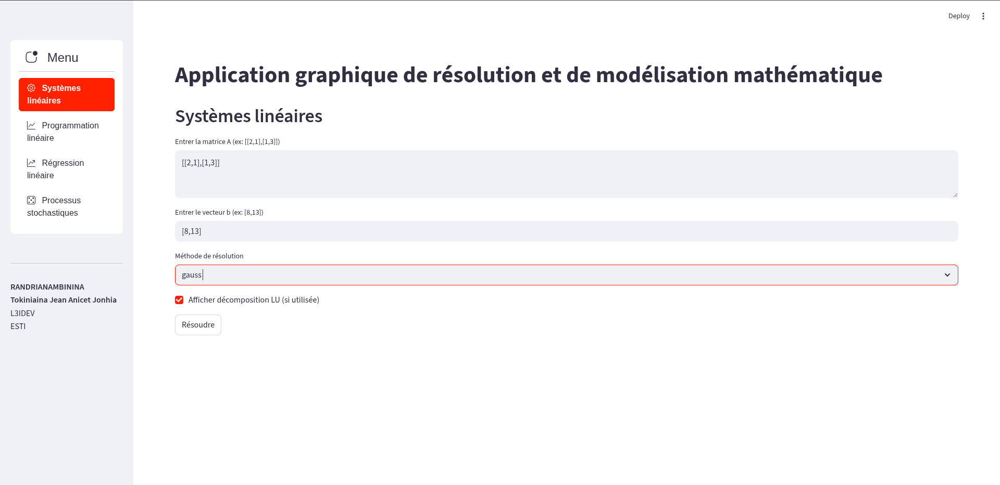
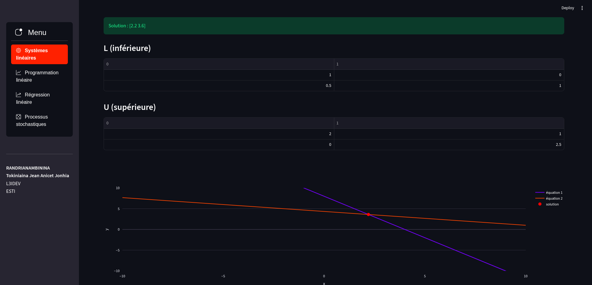
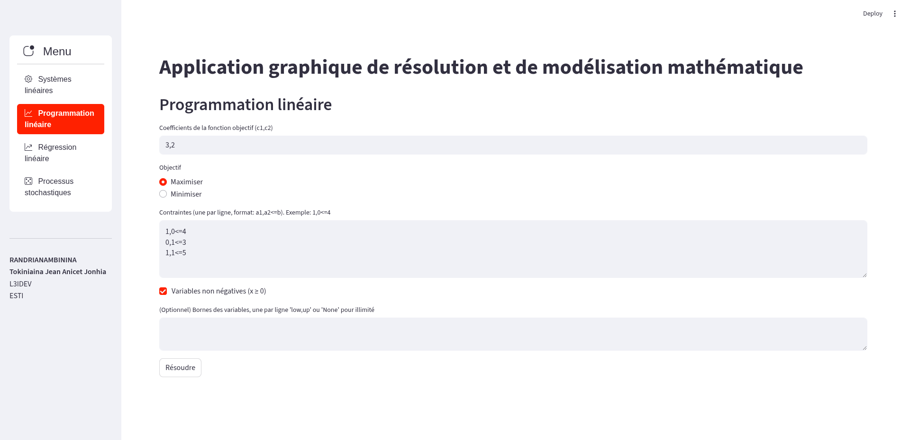
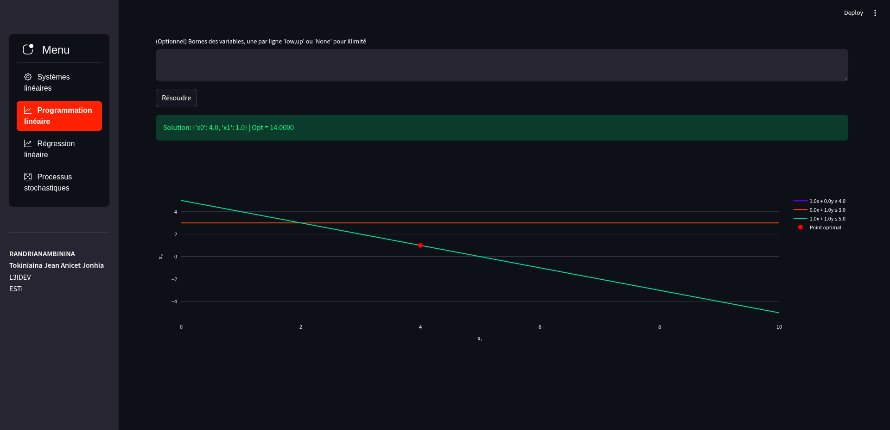
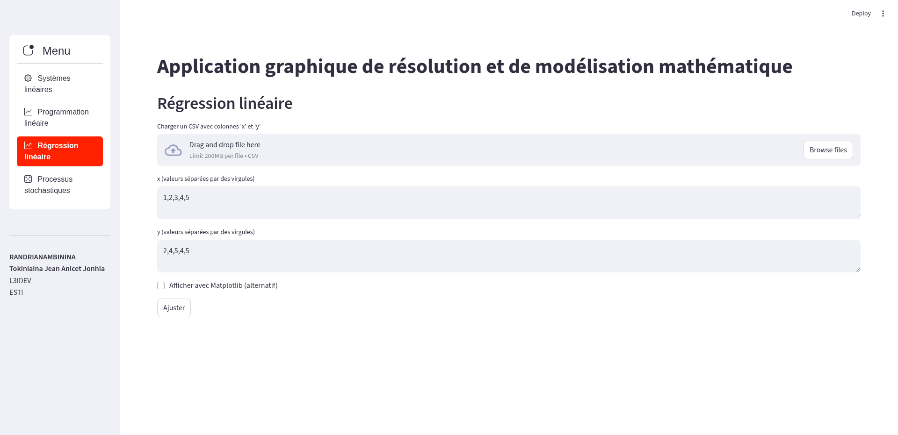
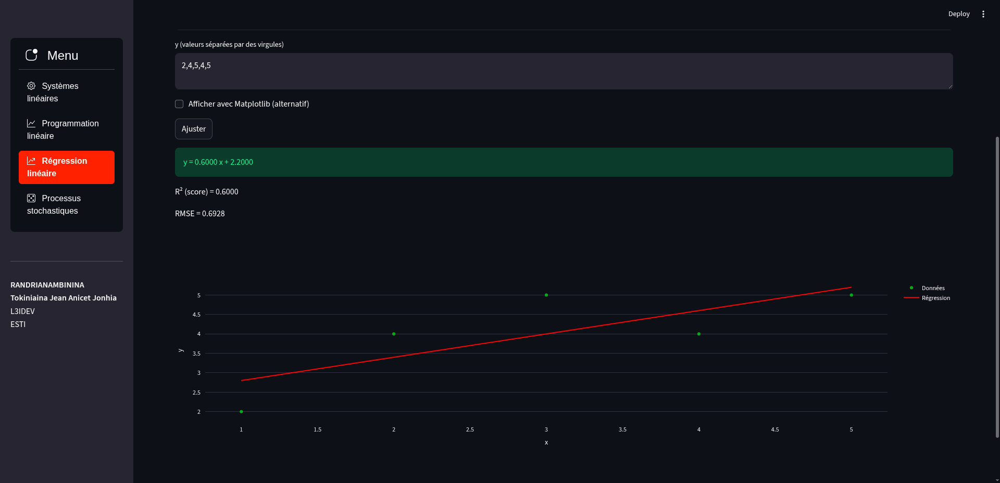
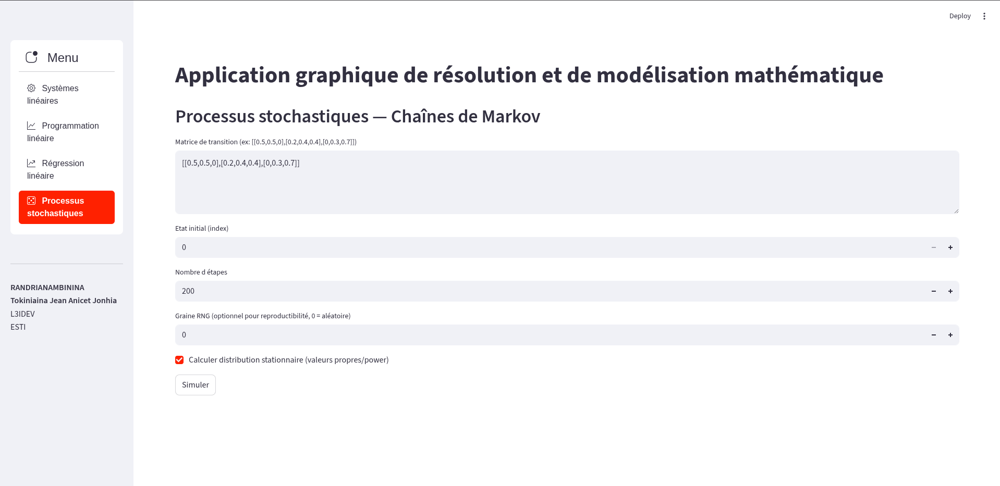
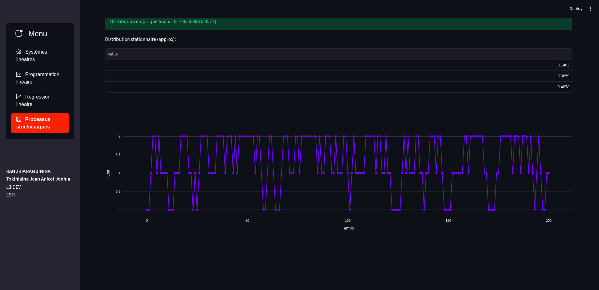

# Application graphique de résolution et de modélisation mathématique

Ce dépôt contient une application Python avec interface graphique (Streamlit) permettant
d’effectuer des calculs mathématiques avancés dans les domaines suivants :

1. Résolution de systèmes linéaires
2. Programmation linéaire
3. Régression linéaire
4. Processus stochastiques (simulation de chaînes de Markov)

Le code est organisé en :
- `core/` : implémentations algorithmiques et fonctions de calcul
- `ui/` : modules Streamlit (une page par fonctionnalité)
- `datas/` : jeux de données et captures d'écran
- `docs/` : documentation supplémentaire

---

## Table des matières
- [Installation et lancement](#installation-et-lancement)
- [Architecture du projet](#architecture-du-projet)
- [Modules et algorithmes](#modules-et-algorithmes)
- [Interface utilisateur](#interface-utilisateur)
- [Jeux de tests et captures d'écran](#jeux-de-tests-et-captures-décran)
- [Limitations et pistes d'amélioration](#limitations-et-pistes-damélioration)
- [Licence / Remarques](#licence--remarques)

---

## Installation et lancement

Suivez ces instructions selon votre système d'exploitation. L'objectif : créer un environnement virtuel, installer les dépendances et lancer l'application avec une seule commande `python main.py`.

### Pré-requis
- Python 3.10+ recommandé
- Git (optionnel)

### Récupérer le projet

```bash
# cloner depuis GitHub (optionnel)
git clone https://github.com/AnicetJonhia/ScientificPythonApplication.git
cd "ScientificPythonApplication"
```

### Linux / macOS

```bash
# créer et activer un environnement virtuel
python3 -m venv venv
source venv/bin/activate

# installer dépendances
python -m pip install --upgrade pip
python -m pip install -r requirements.txt

# lancer l'application
python main.py
```

Après `python main.py`, Streamlit démarre et affiche l'URL locale (par défaut http://localhost:8501) : ouvrez-la dans votre navigateur.

### Windows (PowerShell)

```powershell
# créer et activer venv
python -m venv venv
venv\Scripts\Activate.ps1

# installer dépendances
python -m pip install --upgrade pip
python -m pip install -r requirements.txt

# lancer
python main.py
```

> Si l'exécution des scripts est bloquée, exécutez PowerShell en tant qu'administrateur et exécutez:
>
> `Set-ExecutionPolicy -ExecutionPolicy RemoteSigned -Scope CurrentUser`

### Lancer Streamlit directement (optionnel)

```bash
streamlit run app.py
```

### Dépannage rapide
- Erreur "Could not find the 'streamlit' module": activez venv et installez les dépendances
- Si le port 8501 est occupé, Streamlit proposera un autre port

---

## Architecture du projet
- `core/` : fonctions de calcul (systèmes linéaires, programmation linéaire, régression, stochastique)
- `ui/` : pages Streamlit pour chaque fonctionnalité
- `datas/` : jeux de données d'exemple et captures d'écran
- `docs/` : documentation additionnelle

---

## Modules et algorithmes

### 1) Systèmes linéaires
- Méthodes disponibles : résolution directe (`numpy.linalg.solve`), élimination de Gauss (avec pivot partiel), décomposition LU (Doolittle), moindres carrés (`numpy.linalg.lstsq`).
- API : `core.linear_system.solve_linear_system(A, b, method='auto'|'gauss'|'lu'|'lstsq'|'direct')`.

### 2) Programmation linéaire
- Modélisation via PuLP (si installé). Supporte maximisation/minimisation, contraintes `<=`, `>=`, `==`, et bornes de variables.
- API : `core.linear_programming.solve_lp(c, A, b, maximize=True, bounds=None, signs=None)`.

### 3) Régression linéaire
- Utilise `scikit-learn` `LinearRegression` si disponible, sinon `numpy.polyfit` en fallback.
- Retourne coefficients et fonction de prédiction; option `return_score=True` pour récupérer R².

### 4) Processus stochastiques
- Simulation de chaînes de Markov, distribution empirique, estimation de la distribution stationnaire (méthode des valeurs propres puis power iteration).

---

## Interface utilisateur

L'interface est développée avec Streamlit. Un menu latéral permet de sélectionner l'un des quatre modules. Chaque module propose :
- saisie manuelle des données (matrices, vecteurs, contraintes)
- upload de fichiers CSV lorsque pertinent
- sélection de la méthode de résolution (quand applicable)
- affichage des résultats textuels et graphiques (Plotly / Matplotlib)

Pour démarrer, lancez `python main.py` puis utilisez la sidebar pour naviguer.

---

## Jeux de tests et captures d'écran
Les captures se trouvent dans `datas/screenshots/`.

### Systèmes linéaires
Light:


Dark:


### Programmation linéaire
Light:


Dark:


### Régression linéaire
Light:


Dark:


### Processus stochastiques
Light:


Dark:


---

## Limitations et pistes d'amélioration
- La décomposition LU actuelle n'inclut pas de pivotage complet ; ajouter le pivotage améliorerait la robustesse numérique.
- Améliorer l'éditeur de matrices (grille interactive) pour la saisie directe.
- Ajouter des tests unitaires (`pytest`) pour `core/`.

---

